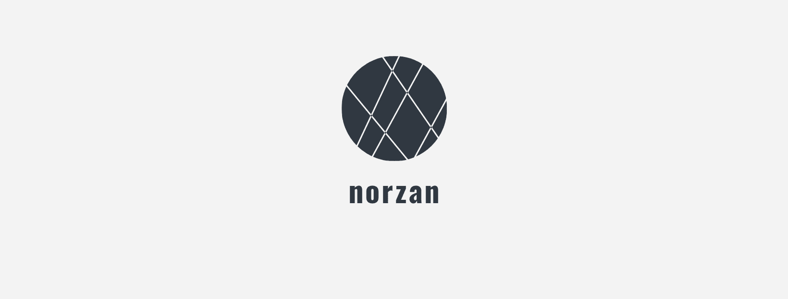

# Norzan

<p align="center">
  
</p>

Norzan is a Chrome Extension to display the rest of workable time into it's new tab. The extension allows you to represent your time to your co-workers and strongly persist that **"I don't wanna work overtime !!"**.

## Usage

The easiest way to install is downloading from [Chrome Web Store](https://chrome.google.com/webstore/detail/norzan/njbkbgbnhlmgmneldkienakbbeadngih).  
Another way, download zip package on [this Release page](https://github.com/diescake/norzan/releases) and load it manually on `chrome://extensions/`.

## Development

Clone this repository and run below command. Generate production codes and collect assets under the `dist/prod` directory. If you want to run in your Chrome browser, load the `prod` directory as unpacked Chrome Extension. For more information, see the official tutorial; [Getting Started Tutorial](https://developer.chrome.com/extensions/getstarted)

```sh
$ yarn watch
```

## Publication

Create the zip package by bellow commands and upload it to the Chrome Web Store.

```sh
$ yarn build
$ yarn package
```

## Config

Actually, you don't have to edit `norzan.config.js` directly.

```js
{
  durationFormat: 'hh:mm:ss.SS', // See. Moment.js format
  updateIntervalMs: 90,
  openingTime: '10:30:00',
  closingTime: '19:00:00',
  messageInClosed: 'During non-business hours.',
  backgroundColor: '#222222', // Actually, enter this from the color picker in your browser.
  googleFont: '', // Details below.
  fontColor: '#e3e3e3',
}
```

### Google fonts

Norzan supports Web Fonts provided on [Google Fonts](https://fonts.google.com/). If you want to use this function, pick up your favorite font on the site and enter it's font-family name such as `Nova Mono`, `Staatliches` or `Indie Flower`.

Then, monospace fonts are recommended because proportional fonts shake the numbers at every updating time.

## Logo

This overcool [logo](https://github.com/diescake/norzan/blob/master/icon.png) is generated by [hatchful](https://hatchful.shopify.com).

## License

[MIT License](https://github.com/diescake/norzan/blob/master/LICENSE)

## Author

Daisuke Kondo (a.k.a diescake)
